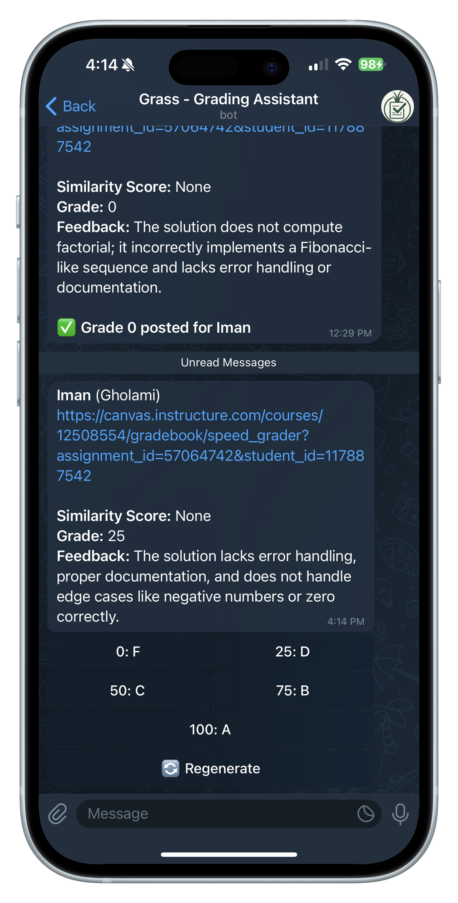
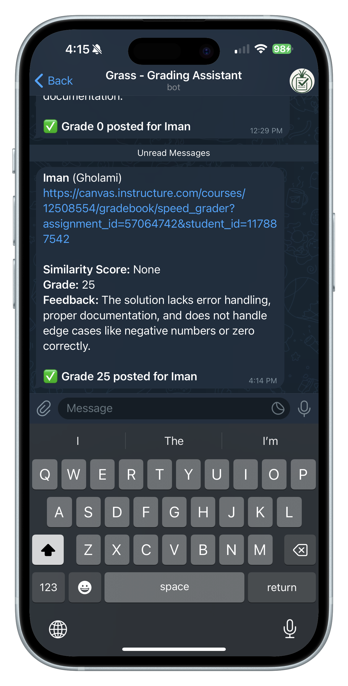
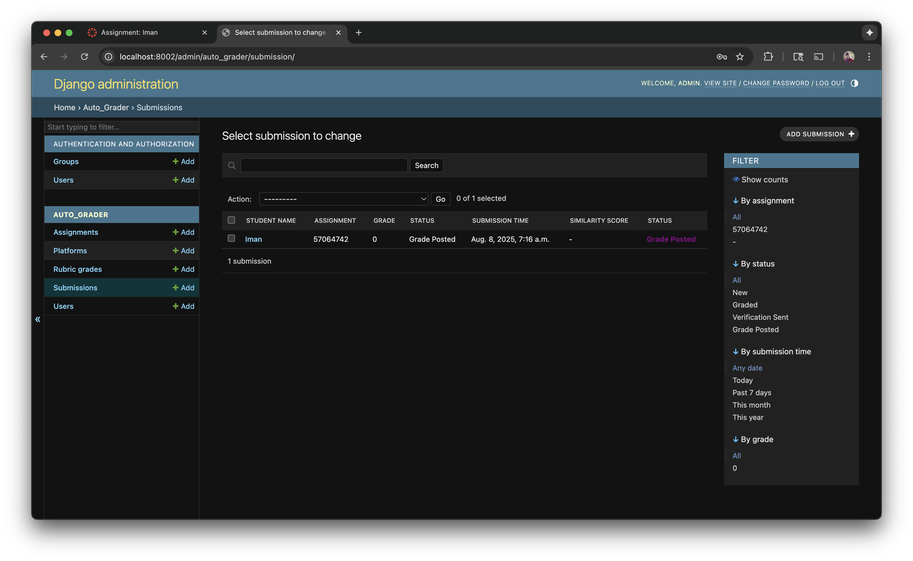
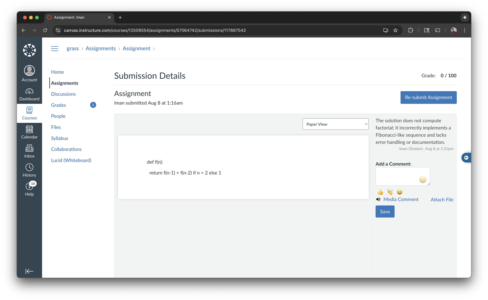

# AutoGrading System

An intelligent automated grading platform that integrates **Canvas LMS**, **ChatGPT**, and **Telegram** to streamline the academic grading process. The system automatically retrieves student submissions, generates AI-powered feedback and grades, and provides instructors with an intuitive interface for review and approval.

---

## 🌟 Features

### 💰 **Chatgpt api cost**
- **💵 Cost Effective for test**: Uses ChatGPT web interface to avoid API costs for testing this system.
- **⚠️ Production usage**: For production, consider using the official OpenAI API for compliance

### 🤖 **AI-Powered Grading & Assessment**
- **📋 Rubric-Based Scoring**: Configurable numerical grades based on assignment rubrics
- **🎯 Context-Aware Feedback**: AI generates relevant feedback tailored to assignment requirements
- **🔄 Multi-Line Input Support**: Handles complex prompts with proper formatting

### 🏛️ **Learning Management System Integration**
- **📚 Canvas LMS Support**: Automatically fetches submissions and posts grades back
- **📊 Similarity Detection**: Integrates with Turnitin similarity scores from Canvas
- **🔗 Multi-Platform Architecture**: Extensible design for other LMS platforms

### 📱 **Interactive Review Interface**
- **⚡ Real-time Telegram Notifications**: Instant messages when new submissions need review
- **🎮 Dynamic Grade Buttons**: Automatically generated from assignment rubric configurations
- **🔄 Full Control Options**: Regenerate grades, skip submissions, or approve with one tap

## 🏗️ System Architecture

```
Canvas LMS ←→ Django Backend ←→ ChatGPT (Selenium)
                    ↓
              Telegram Bot ←→ Instructor
```

## 📋 Prerequisites

- **Python 3.12+**
- **Google Chrome** browser
- **ChromeDriver**
- **Canvas LMS** access with API token
- **Telegram Bot** token
- **ChatGPT** account

## ⚙️ Installation

1. **Clone the repository**:
   ```bash
   git clone <repository-url>
   cd AutoGrading
   ```

2. **Create virtual environment**:
   ```bash
   python -m venv .venv
   source .venv/bin/activate  # On Windows: .venv\Scripts\activate
   ```

3. **Install dependencies**:
   ```bash
   pip install -r requirements.txt
   ```

4. **Configure environment variables**:
   Copy the example environment file and update with your credentials:
   ```bash
   cp .env.example .env
   ```
   
   Edit `.env` with your actual values:
   ```bash
   # Django Configuration
   SECRET_KEY=your-unique-secret-key-here
   DEBUG=True
   
   # Telegram Bot Configuration
   TELEGRAM_BOT_TOKEN=your_telegram_bot_token_here
   
   # Canvas LMS Configuration
   CANVAS_API_KEY=your_canvas_api_key_here
   CANVAS_API_URL=https://your-institution.instructure.com
   
   # Chrome/Selenium Configuration (update paths as needed)
   CHROME_DRIVER_PATH=chromedriver-mac-arm64/chromedriver
   CHROME_PATH=/Applications/Google Chrome.app/Contents/MacOS/Google Chrome
   ```

5. **Initialize database**:
   ```bash
   python manage.py makemigrations
   python manage.py migrate
   ```

## 📸 Screenshots

> **Note**: Add your screenshots to the `screenshots/` directory with the following filenames to display them here.

### Telegram Grading Interface
*Interactive grade review with dynamic rubric-based buttons*

 

*Shows the Telegram interface with:*
- Student submission details and Canvas link
- AI-generated grade and feedback
- Dynamic grade buttons based on assignment rubric
- Regenerate and skip options

### Django Admin Dashboard
*Comprehensive submission and assignment management*



*Features visible in admin:*
- Submission status tracking (new, graded, verification_sent, grade_posted)
- Assignment management with rubric configuration
- Bulk operations and filtering
- Real-time statistics and progress monitoring


### Canvas Grade Integration
*Automatic grade posting back to Canvas LMS*



*Shows:*
- Numerical grades posted from rubric
- Feedback comments automatically added
- Grade history and submission details
- Canvas gradebook integration

---

## 🚀 Usage

### Starting the System

1. **Start the Telegram bot**:
   ```bash
   python manage.py run_bot
   ```

2. **Run the grading automation** (in a separate terminal):
   ```bash
   python manage.py grader_job
   ```

### Instructor Setup

1. **Start conversation with bot**: Send `/start` to your Telegram bot
2. **Add assignments**: Configure assignments in the Django admin or database
3. **Review grades**: Receive notifications and use interactive buttons to approve/modify grades

## 🔄 Workflow

1. **Submission Detection**: System monitors Canvas for new submissions
2. **AI Processing**: ChatGPT analyzes submissions using assignment rubrics
3. **Instructor Notification**: Telegram message sent with AI-generated grade and feedback
4. **Review Process**: Instructor can approve, modify, or regenerate grades using buttons
5. **Grade Posting**: Approved grades are automatically posted back to Canvas
6. **Timestamp Update**: System tracks last processed submission to avoid duplicates

## ⚠️ **IMPORTANT DISCLAIMER**

**Automating ChatGPT via the web interface using Selenium may violate OpenAI's [Terms of Service](https://openai.com/policies/terms-of-use).**

You are solely responsible for any actions taken with this software.  
The author assumes no responsibility for account bans, legal issues, or misuse.

For compliant programmatic access, consider using the [OpenAI API](https://platform.openai.com/docs/).

